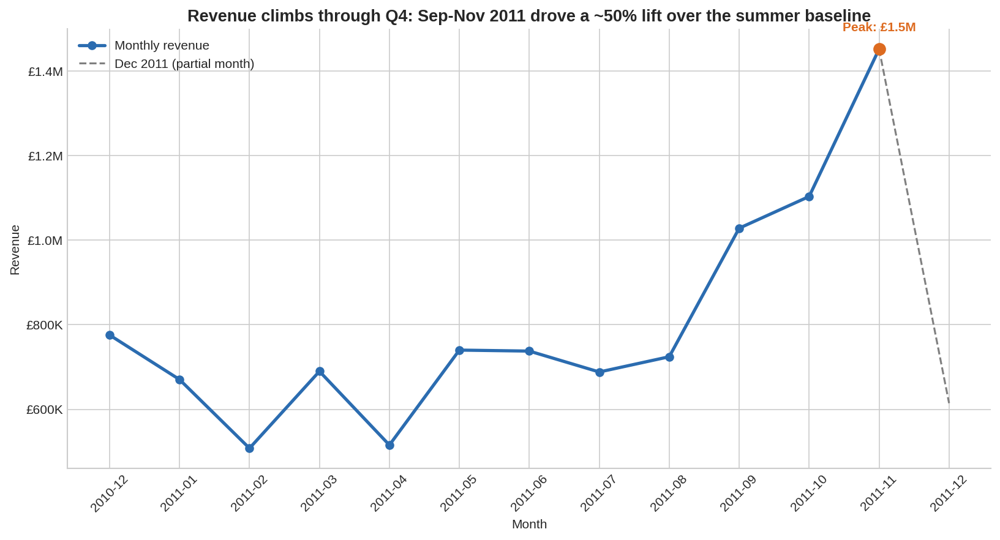
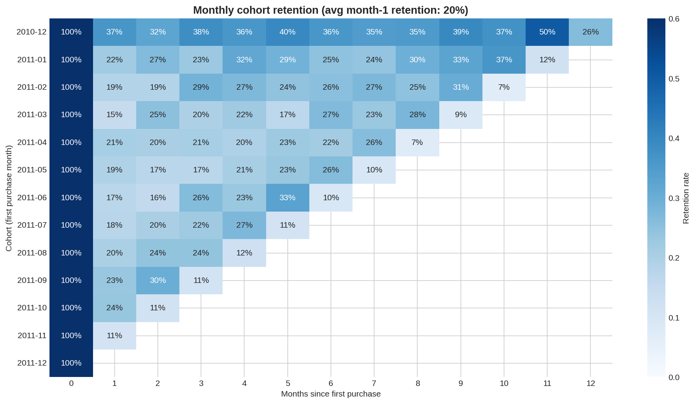
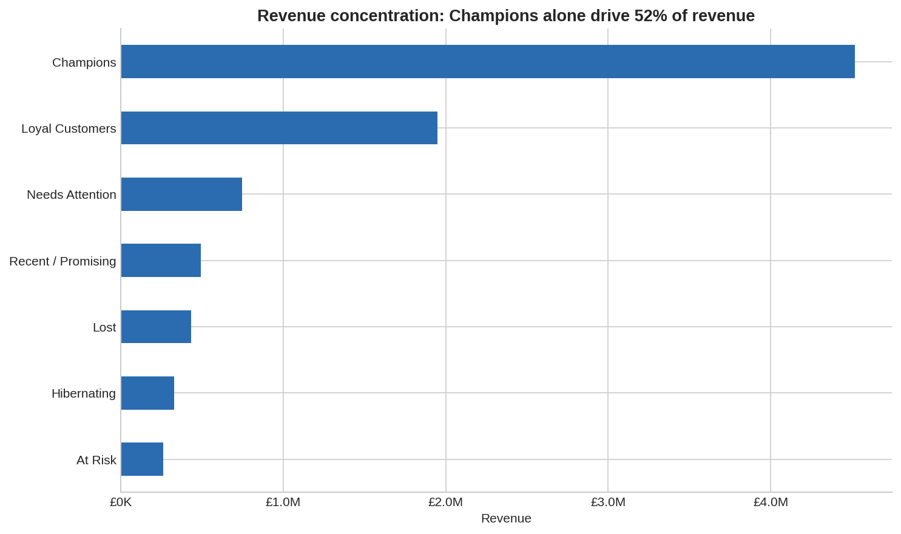
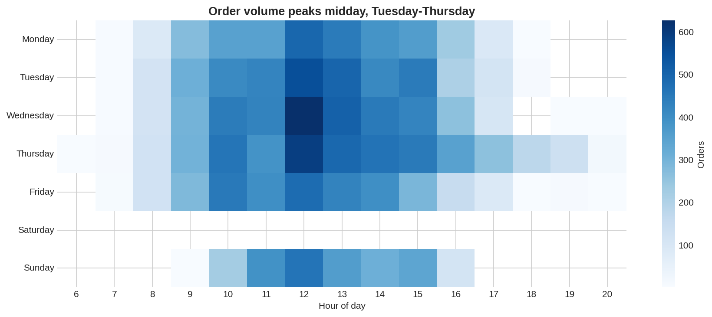

# Online Retail Analytics — Sales Trends, Customer Segmentation & Retention

End-to-end analysis of ~540,000 transactions from a UK-based online retailer (Dec 2010 – Dec 2011), using the public [UCI Online Retail dataset](https://archive.ics.uci.edu/dataset/352/online+retail). The project cleans raw transaction data, analyzes revenue trends, segments customers with RFM scoring, and measures retention with cohort analysis.

**Tools:** Python (pandas, matplotlib, seaborn)

## Key Findings

- **£10.2M revenue across 19,773 orders** (avg. order value £518) after cleaning — 96.4% of raw rows retained after removing cancellations, adjustments, and duplicates.
- **Q4 seasonality is the dominant revenue driver.** Sep–Nov 2011 revenue ran roughly 65% above the May–Aug baseline, peaking at £1.45M in November — clear evidence the business should front-load inventory and marketing spend ahead of Q4.
- **Revenue is highly concentrated: the top 14% of customers ("Champions") generate 52% of revenue.** Combined with Loyal Customers, the top two RFM segments account for ~74% of revenue, making retention programs far higher-leverage than broad acquisition.
- **Average month-1 retention is only ~20%**, meaning 4 out of 5 new customers never return the following month. Cohort curves flatten after month 1, so the biggest retention opportunity is the first repeat purchase.
- **85% of revenue comes from the UK**; the Netherlands, Ireland, Germany, and France lead international sales — a shortlist for targeted expansion.

## Visuals

| | |
|---|---|
|  |  |
|  |  |

## Project Structure

```
online-retail-analytics/
├── data/                     # Raw + cleaned data (not committed — see data/README.md)
├── src/
│   ├── 01_data_cleaning.py   # Remove cancellations, bad prices, dupes; derive Revenue
│   ├── 02_sales_analysis.py  # Monthly trends, top products, geography, order timing
│   ├── 03_rfm_segmentation.py# Quartile RFM scores → 7 named customer segments
│   └── 04_cohort_retention.py# Monthly cohort retention heatmap
└── outputs/
    ├── figures/              # PNG charts
    └── tables/               # Segment summaries, retention matrix, monthly summary
```

## Methodology Notes

- **Cleaning:** Cancelled invoices (prefix `C`), non-positive quantities/prices, non-product stock codes (postage, fees, manual adjustments), and exact duplicates are removed (~3.6% of rows).
- **Missing CustomerID (~25% of rows)** is kept for revenue analysis but excluded from RFM and cohort analysis, since those rows can't be attributed to a customer.
- **RFM scoring** uses quartiles on recency, frequency (unique invoices), and monetary value, with a snapshot date one day after the last transaction. Score combinations map to 7 business segments (Champions, Loyal, At Risk, etc.).
- **Dec 2011 is a partial month** (data ends Dec 9) and is flagged in trend charts rather than silently included.

## How to Run

```bash
pip install -r requirements.txt
# Download the dataset (see data/README.md), then:
python src/01_data_cleaning.py
python src/02_sales_analysis.py
python src/03_rfm_segmentation.py
python src/04_cohort_retention.py
```

